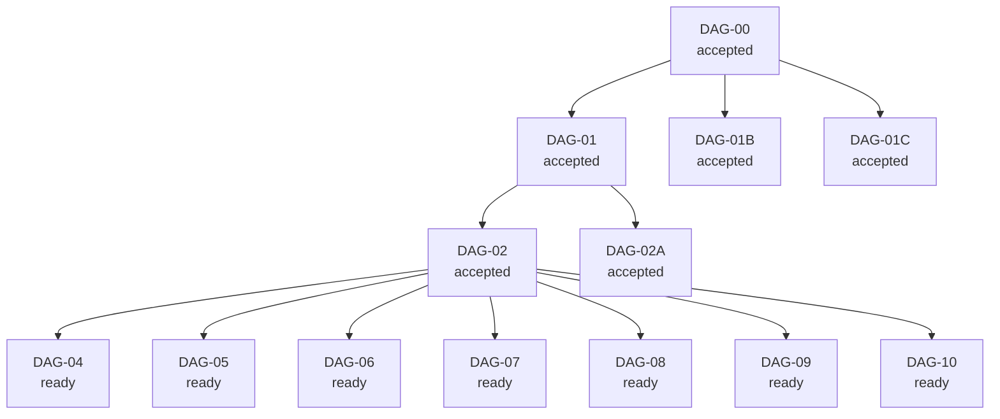

<!-- GENERATED FILE. DO NOT EDIT DIRECTLY.
Source of truth: canonical/** and state/**
Regenerate with: bun run render
-->

# Implementation Graph

Graph artifacts:
- `views/IMPLEMENTATION_GRAPH.mmd`
- `state/graph/implementation-graph.json`

## Summary

- nodes: 13
- edges: 12
- ready frontier: 7
- blocked nodes: 0

Current frontier:

- ready: DAG-04 DAG-04: Every artifact belongs to exactly one class. The class determines placement, ownership, deletion
- ready: DAG-05 DAG-05: Event enum is closed; new code must not emit run_started or legacy run_blocked
- ready: DAG-06 DAG-06: Check registry entries conform to minimum schema
- ready: DAG-07 DAG-07: Active CLI command inventory is exact; removed commands must not appear in active surfaces
- ready: DAG-08 DAG-08: Adapter translates canonical packet/result and does not own execution
- ready: DAG-09 DAG-09: Working run packets and working handoffs live under .atelier/runs/** and are derived
- ready: DAG-10 DAG-10: Actors and surfaces may write/promote only authorized artifact classes

Blocked nodes:

- none

## Mermaid

